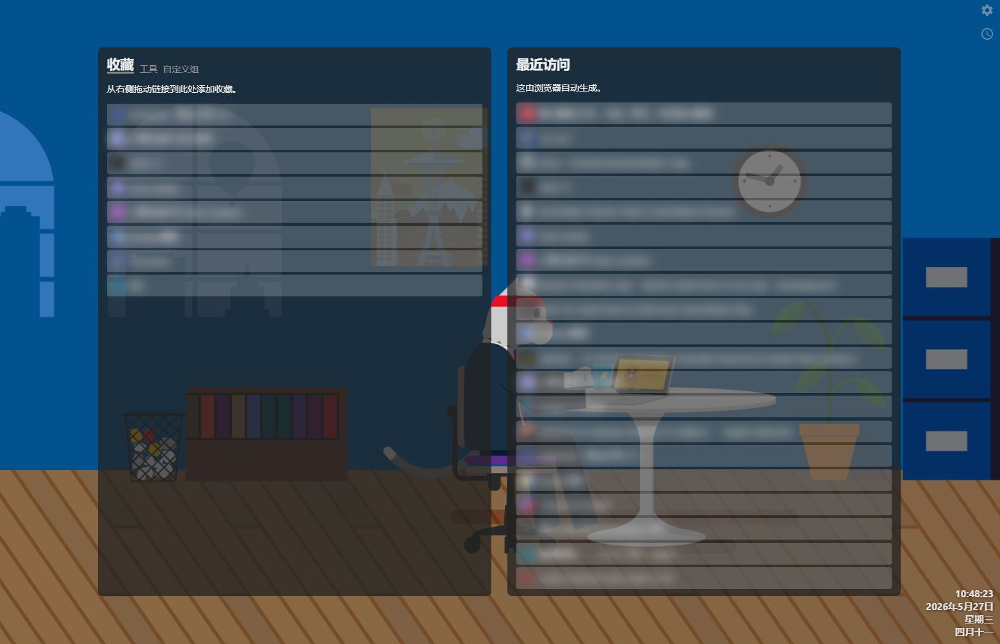
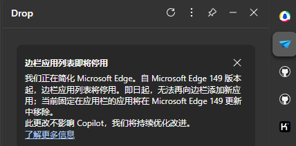
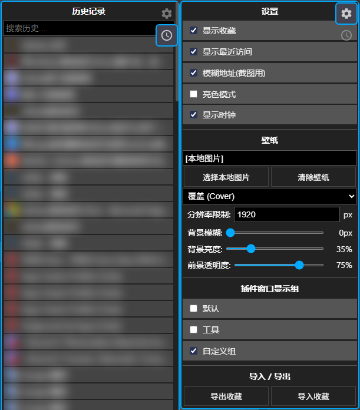
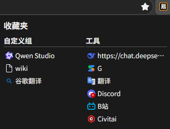
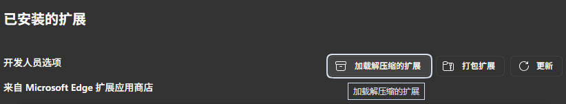
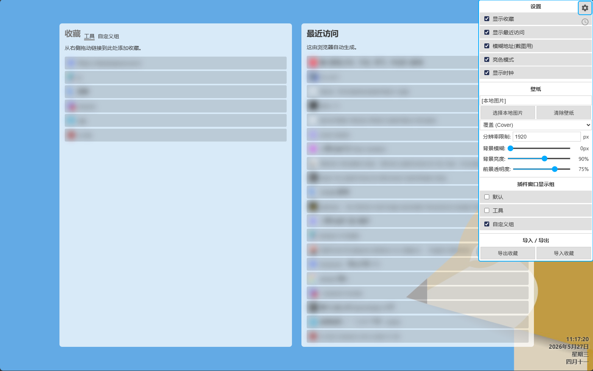

## 简易起始页

个人使用的简单浏览器新标签页主页插件。

  

### 核心理念
在我这里，自定主页目的就是：**去广告** 和 打开**最近常网站**。  
不需要书签同步，同步是浏览器的事。想同步书签和历史浏览器自身就能做到。  
插件好处在于可以暂时收藏需要的网站，而不挤占收藏栏，而且不会随着清理缓存时"最近访问"被清理而被清理。

### 制作原因

我知道inftab不错，也用了很久。但后来因为推广、塞AI、占用高之类问题，现在又出了安全问题。  
还有windows 11 展开时间和日期时不显示秒(我不希望托盘显示秒，因为任务栏是竖着用的。现在默认显示秒了)。  
所以之前自己搓了个简单替代，使用浏览器api显示最近访问。  

**最近**  
因为edge侧栏禁止固定网站了，所以想着是否有办法绕过限制。  
很遗憾发现插件限制很大，不能代替书签，不能打开内部chrome/edge开头网页。  
因为插件需要在不同位置点两到三次，代替书签不实用，且功能上弱于书签。  
因此边踩坑边完善一下插件基础功能。  

  

### 功能
最近访问 - 这是浏览器api自动生成的。会在清缓存时清除。  
收藏 - 拖放网址时添加收藏，可以自定义多组。  
历史记录 - 加载最近的历史，但加载的不多，支持搜索。和浏览器自身的历史记录显示上不太一样，未合并访问。  
  
模糊显示 - 只是截图用  
时钟 - 显示秒，显示农历  
壁纸 - 可以使用本地图像，设置显示模式，并做了压缩。  
导入导出收藏 - 使用简单的markdown格式  
设置点击插件图标时显示的组 - 意义不大  

### 使用

因为自用，目前没有发布计划。  
在浏览器插件页面加载解压的插件即可。  
缺点是浏览器不希望这么使用插件，每两周浏览器会弹次提示。

亮色主题+设置(设置和历史在右上角,不显眼)
